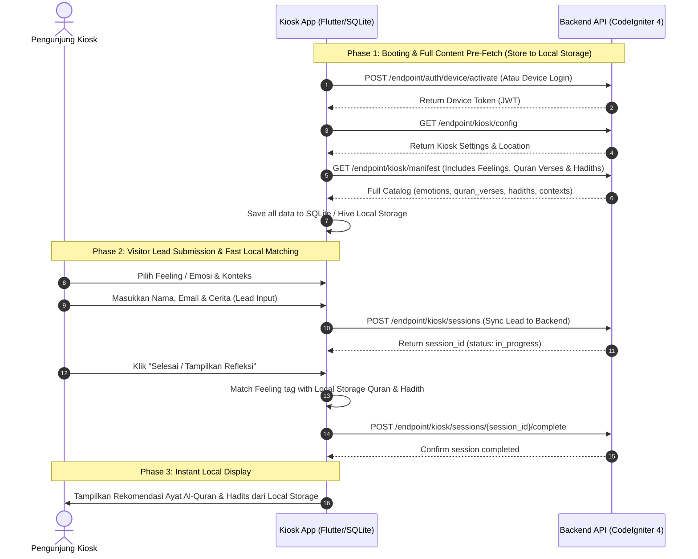

# Dokumentasi Integrasi Kiosk App & Backend Akumerasa

Dokumen ini berisi panduan teknis integrasi antara **Aplikasi Perangkat Kiosk (Frontend)** dengan **Akumerasa Backend API**. Panduan ini berfokus pada **Otentikasi Perangkat**, **Pre-fetching Seluruh Content ke Local Storage (Feeling, Hadits, Al-Quran, Konteks)**, **Submit Lead Visitor**, serta **Matching Rekomendasi Lintas Konten**.

---

## 🏗️ Arsitektur & Alur Pre-Fetching (Local Storage Flow)

Kiosk App menggunakan strategi **Pre-Fetch & Offline First**. Seluruh master data **Feeling/Emosi (`emotions`)**, **Ayat Al-Quran (`quran_verses`)**, **Hadits (`hadiths`)**, dan **Konteks (`contexts`)** di-download sekaligus saat Kiosk booting dan disimpan ke dalam **Local Storage / SQLite** perangkat.



---

## 🔑 1. Otentikasi Perangkat (Device Authentication)

Setiap request terproteksi wajib menyertakan HTTP Header:

```http
Authorization: Bearer <device_token>
Content-Type: application/json
```

---

### 1.1 Aktivasi Perangkat Baru (Device Activation)

* **Endpoint:** `POST /endpoint/auth/device/activate`
* **Auth Required:** Tidak (Public)
* **Request Body:**

```json
{
  "activation_code": "123456",
  "device_fingerprint": "fp_kiosk_masjid_al_akbar_01",
  "platform": "android",
  "app_version": "1.0.0",
  "device_name": "Kiosk Lobby Utama"
}
```

* **Response Sukses (200 OK):**

```json
{
  "success": true,
  "message": "Device activated successfully.",
  "data": {
    "device_token": "eyJhbGciOiJIUzI1NiIsInR5cCI6IkpXVCJ9...",
    "expires_in": 31536000,
    "kiosk_id": 1,
    "tenant_id": 1,
    "location_id": 1
  }
}
```

---

## ⚙️ 2. Pre-Fetching Full Catalog ke Local Storage (`GET /endpoint/kiosk/manifest`)

Saat booting, Kiosk App memanggil endpoint ini untuk mengunduh **seluruh database konten** yang berstatus `approved`/`active`, lalu menyimpannya di **Local Storage / SQLite** perangkat.

* **Endpoint:** `GET /endpoint/kiosk/manifest`
* **Auth Required:** Ya (`Authorization: Bearer <device_token>`)
* **Response Sukses (200 OK):**

```json
{
  "success": true,
  "message": "Success",
  "data": {
    "emotions": [
      {
        "id": 19,
        "name": "bahagia",
        "icon": "smile",
        "description": "Perasaan senang, bersyukur, dan tenang",
        "category": "bahagia",
        "sort_order": 1
      },
      {
        "id": 25,
        "name": "sedih",
        "icon": "frown",
        "description": "Perasaan duka, kehilangan, atau terpukul",
        "category": "Sedih",
        "sort_order": 1
      },
      {
        "id": 28,
        "name": "cemas",
        "icon": "alert",
        "description": "Perasaan khawatir akan masa depan atau rezeki",
        "category": "Cemas",
        "sort_order": 4
      },
      {
        "id": 30,
        "name": "lelah",
        "icon": "tired",
        "description": "Penat dengan aktivitas, pekerjaan, atau ujian hidup",
        "category": "Marah",
        "sort_order": 6
      }
    ],
    "contexts": [
      {
        "id": 1,
        "name": "Pekerjaan & Karir",
        "description": "Tantangan rezeki dan tempat kerja",
        "sort_order": 1
      },
      {
        "id": 2,
        "name": "Keluarga & Hubungan",
        "description": "Hubungan antar anggota keluarga",
        "sort_order": 2
      }
    ],
    "quran_verses": [
      {
        "id": 150,
        "surah": 2,
        "ayat_number": 155,
        "arabic_text": "وَلَنَبْلُوَنَّكُم بِشَيْءٍ مِّنَ الْخَوْفِ وَالْجُوعِ وَنَقْصٍ مِّنَ الْأَمْوَالِ وَالْأَنفُسِ وَالثَّمَرَاتِ ۗ وَبَشِّرِ الصَّابِرِينَ",
        "translation": "Dan Kami pasti akan menguji kamu dengan sedikit ketakutan, kelaparan, kekurangan harta, jiwa, dan buah-buahan. Dan sampaikanlah kabar gembira kepada orang-orang yang sabar.",
        "source": "QS. Al-Baqarah: 155",
        "tags": "sedih, ujian, sabar",
        "status": "approved"
      },
      {
        "id": 151,
        "surah": 94,
        "ayat_number": 6,
        "arabic_text": "إِنَّ مَعَ الْعُسْرِ يُسْرًا",
        "translation": "Sesungguhnya bersama kesulitan ada kemudahan.",
        "source": "QS. Al-Insyirah: 6",
        "tags": "cemas, lelah, kemudahan, stres",
        "status": "approved"
      }
    ],
    "hadiths": [
      {
        "id": 2,
        "book": "Bukhari, Muslim",
        "number": "5641, 2573",
        "narrator": "Abu Hurairah",
        "grade": "Shahih",
        "arabic_text": "مَا أَصَابَ الْمُسْلِمَ مِنْ نَصَبٍ وَلاَ وَصَبٍ وَلاَ هَمٍّ وَلاَ حَزَنٍ وَلاَ أَذًى وَلاَ غَمٍّ حَتَّى الشَّوْكَةِ يُشَاكُهَا إِلاَّ كَفَّرَ اللَّهُ بِهَا مِنْ خَطَايَاهُ",
        "translation": "Tidaklah seorang muslim tertimpa suatu keletihan, penyakit, kecemasan, kesedihan, gangguan, maupun duka cita—bahkan duri yang menusuknya—melainkan Allah akan menghapus dosa-dosanya dengan sebab itu.",
        "source": "HR. Bukhari no. 5641 & Muslim no. 2573",
        "tags": "sedih, pengugur dosa, musibah, lelah",
        "status": "approved"
      },
      {
        "id": 3,
        "book": "Bukhari",
        "number": "6369",
        "narrator": null,
        "grade": null,
        "arabic_text": "اللَّهُمَّ إِنِّي أَعُوذُ بِكَ مِنَ الْهَمِّ وَالْحَزَنِ وَالْعَجْزِ وَالْكَسَلِ",
        "translation": "Ya Allah, aku berlindung kepada-Mu dari rasa gelisah, sedih, lemah, dan malas.",
        "source": "HR. Bukhari no. 5641",
        "tags": "doa, perlindungan, sedih, cemas",
        "status": "approved"
      }
    ]
  }
}
```

---

## 💾 3. Panduan Penyimpanan Local Storage Kiosk App

Setelah menerima response `manifest`, Kiosk App wajib menyimpan data tersebut ke dalam struktur tabel/toko lokal:

```text
Local Storage Schema (SQLite / Hive / Room):
┌──────────────────┐    ┌──────────────────┐
│   tbl_emotions   │    ┌──────────────────┐  │  tbl_quran_verses│
├──────────────────┤    │   tbl_contexts   │  ├──────────────────┤
│ id (PK)          │    ├──────────────────┤  │ id (PK)          │
│ name             │    │ id (PK)          │  │ surah            │
│ icon             │    │ name             │  │ ayat_number      │
│ description      │    │ description      │  │ arabic_text      │
│ category         │    └──────────────────┘  │ translation      │
│ sort_order       │                          │ tags             │
└──────────────────┘                          └──────────────────┘
                                              ┌──────────────────┐
                                              │   tbl_hadiths    │
                                              ├──────────────────┤
                                              │ id (PK)          │
                                              │ book             │
                                              │ arabic_text      │
                                              │ translation      │
                                              │ tags             │
                                              └──────────────────┘
```

---

## 🔍 4. Algoritma Pencocokan Lokal (Local Matching Algorithm)

Ketika pengunjung memilih **Feeling / Emosi (`emotion_id`)** di layar Kiosk, Kiosk App melakukan filter langsung di Local Storage tanpa harus menunggu jaringan:

1. Ambil `name` dan `category` dari `tbl_emotions` berdasarkan `emotion_id` terpilih (misal: `name = "sedih"`).
2. Filter `tbl_quran_verses` lokal di mana `tags LIKE '%sedih%'` ATAU `tags LIKE '%Sedih%'`.
3. Filter `tbl_hadiths` lokal di mana `tags LIKE '%sedih%'` ATAU `tags LIKE '%Sedih%'`.
4. Pilih 1 item secara acak (*random choice*) dari hasil filter untuk ditampilkan di layar Kiosk.

---

## 📝 5. Alur Submit Visitor Leads & Sinkronisasi Sesi (Session Sync)

---

### 5.1 Step 1: Submit Visitor Leads ke Backend

Dipanggil saat pengunjung menginput Nama, Email, Feeling yang dipilih, dan Cerita.

* **Endpoint:** `POST /endpoint/kiosk/sessions`
* **Auth Required:** Ya (`Authorization: Bearer <device_token>`)
* **Request Body:**

```json
{
  "visitor_name": "Ahmad Fauzi",
  "visitor_email": "ahmad.fauzi@email.com",
  "emotion_id": 25,
  "context_id": 1,
  "cause_id": "pekerjaan",
  "story": "Merasa lelah dan cemas memikirkan pekerjaan serta masa depan rezeki."
}
```

* **Response Sukses (201 Created):**

```json
{
  "success": true,
  "message": "Session created.",
  "data": {
    "id": 89,
    "kiosk_id": 1,
    "location_id": 1,
    "tenant_id": 1,
    "visitor_name": "Ahmad Fauzi",
    "visitor_email": "ahmad.fauzi@email.com",
    "emotion_id": 25,
    "context_id": 1,
    "cause_id": "pekerjaan",
    "story": "Merasa lelah dan cemas memikirkan pekerjaan serta masa depan rezeki.",
    "status": "in_progress",
    "created_at": "2026-08-09 06:05:00"
  }
}
```

---

### 5.2 Step 2: Konfirmasi Sesi Selesai (Complete Session Sync)

Dipanggil saat pengunjung menekan **"Selesai"**. Sesi di backend diupdate menjadi `completed`.

* **Endpoint:** `POST /endpoint/kiosk/sessions/{session_id}/complete`
* **Auth Required:** Ya (`Authorization: Bearer <device_token>`)
* **Request Body:** `{}`
* **Response Sukses (201 Created):**

```json
{
  "success": true,
  "message": "Reflection completed.",
  "data": {
    "session_id": 89,
    "status": "completed"
  }
}
```

---

## 🛠️ Error Codes & Handling Guide

| HTTP Status | Error Message | Penanganan di Kiosk App |
|-------------|---------------|-------------------------|
| `401 Unauthorized` | Invalid or expired token | Jalankan alur `Device Activate` atau `Device Login` ulang |
| `422 Unprocessable Entity` | Validation errors | Tampilkan pesan error validasi pada form input (misal email tidak valid) |
| `404 Not Found` | Session/Kiosk not found | Kembalikan Kiosk ke layar utama (*Idle / Home Screen*) |
| `500 / 503` | Server / Internal Error | Gunakan data yang tersimpan di Local Storage |
